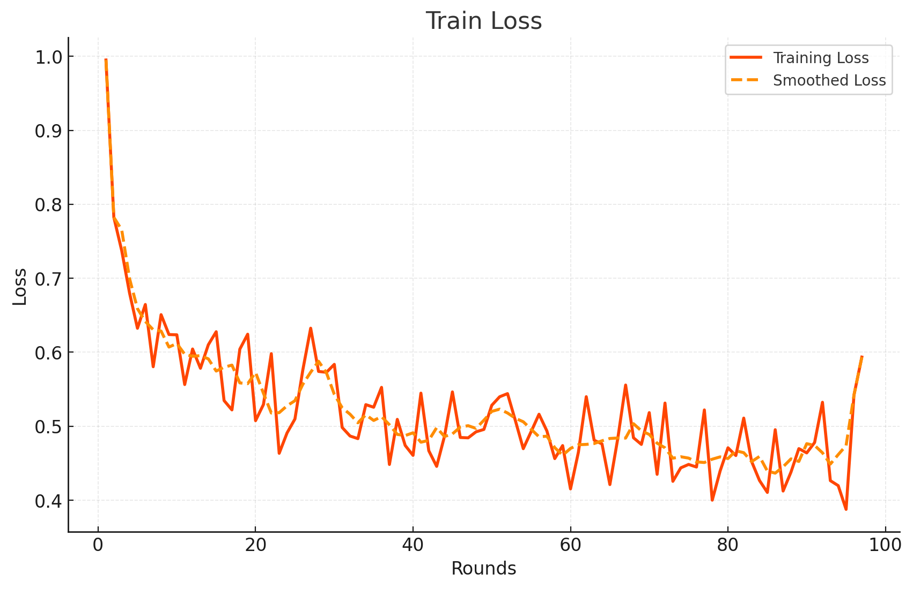

# FlowerTune LLM on Code Dataset

This directory conducts federated instruction tuning with a pretrained [Qwen/Qwen2.5-Coder-0.5B-Instruct](https://huggingface.co/Qwen/Qwen2.5-Coder-0.5B-Instruct) model on a [Code dataset](https://huggingface.co/datasets/sahil2801/CodeAlpaca-20k).
We use [Flower Datasets](https://flower.dev/docs/datasets/) to download, partition and preprocess the dataset.
Flower's Simulation Engine is used to simulate the LLM fine-tuning process in federated way,
which allows users to perform the training on a single GPU.


## Methodology

This baseline performs federated LLM fine-tuning with [DoRA](https://arxiv.org/abs/2402.09353) using the [🤗PEFT](https://huggingface.co/docs/peft/en/index) library.
The clients' models are aggregated with `FedAvg` strategy.
This provides a baseline performance for the leaderboard of Code challenge.

### Qwen2.5-Coder-0.5B-Instruct

For the **Qwen/Qwen2.5-Coder-0.5B-Instruct** model I adopted the following fine-tuning methodology:

- **Precision**: `bf16` for model weights.
- **Quantization**: `4-bit` quantization for reduced memory usage.
- **Optimizer**: `paged_adamw_8bit`
- **[DoRA](https://arxiv.org/abs/2402.09353) Configuration**:
  - Rank (r): `32`
  - Alpha: `64`
  - Target Modules:
    - `down_proj`,
    - `gate_up_proj`,
    - `o_proj`,
    - `qkv_proj`,
- **Training Configuration**:
  - Batch size: `8`
  - Maximum number of steps: `10`
  - Total number of rounds: `100`
  - Fraction fit per round: `0.2`
- **Learning Rate Scheduler**:
  - Cosine Annealing over rounds, where:
    - Maximum LR: `5e-5`
    - Minimum LR: `5e-6`
  - Constant learning rate scheduler over steps
- **Strategy**: `FedAvg`

### Training Loss Visualization

Below is the training loss plot from the experiment:



### Evaluation Results (Pass@1 score)

- **MBPP**:  25.60 %
- **HumanEval**: 37.81 %
- **MultiPL-E (JS)**: 41.00 %
- **MultiPL-E (C++)**: 32.92 %
- **Average**: 34.34 %

The evaluation was conducted on an RTX A4000 16GB.

### Communication Budget

8922.66 MB

### Virtual Machine Details

For this experiment, I utilized [CUDO Compute](https://www.cudocompute.com/?via=flowertune-llm) as the GPU compute provider.

| **Component** | **Specification**    |
|---------------|----------------------|
| **GPU**       | 1 × RTX A4000 16 GB  |
| **vCPUs**     | 4                    |
| **CPU**       | AMD EPYC (Milan)     |
| **Memory**    | 16 GB                |

For an example on how to set up a GPU computing resource on CUDO Compute by using Terraform, please check [./terraform/](./terraform/).

### Cost Breakdown

#### Compute Costs

| **Component** | **Details**   | **Cost/hr** |
|---------------|---------------|-------------|
| vCPUs         | 4 cores       | $0.0088/hr  |
| Memory        | 16 GB         | $0.056/hr   |
| GPU           | 1 × RTX A4000  | $0.25/hr    |

#### Storage Costs

| **Component**    | **Details** | **Cost/hr** |
|------------------|-------------|-------------|
| Boot Disk Size   | 70 GB       | $0.0077/hr  |

#### Network Costs

| **Component**         | **Details** | **Cost/hr** |
|-----------------------|-------------|-------------|
| Public IPv4 Address   | N/A         | $0.005/hr   |

#### Total Cost

| **Total Cost/hr** |
|-------------------|
| **$0.3275/hr**    |

#### Simulation Details

| **Parameter**      | **Value**              |
|--------------------|------------------------|
| **Runtime**        | 1924.52 seconds (00:32:04) |
| **Simulation Cost**| **$0.18**              |

## Environments setup

Project dependencies are defined in `pyproject.toml`. Install them in an activated Python environment with:

```shell
python -m pip install --upgrade pip wheel setuptools packaging

pip install -e .
pip install flash-attn --no-build-isolation   # Install FlashAttention-2
```

## Experimental setup

The dataset is divided into 10 partitions in an IID fashion, a partition is assigned to each ClientApp.
We randomly sample a fraction (0.2) of the total nodes to participate in each round, for a total of `100` rounds.
All settings are defined in `pyproject.toml`.

> [!IMPORTANT]
> Please note that `[tool.flwr.app.config.static]` and `options.num-supernodes` under `[tool.flwr.federations.local-simulation]` are not allowed to be modified for fair competition if you plan to participated in the [LLM leaderboard](https://flower.ai/benchmarks/llm-leaderboard).


## Running the challenge

Run the challenge with default config values.
The configs are defined in `[tool.flwr.app.config]` entry of `pyproject.toml`, and are loaded automatically.

```bash
flwr run
```

## Running the evaluation

Please check [flowertune-eval-code](https://github.com/ethicalabs-ai/FlowerTune-Qwen2.5-Coder-0.5B-Instruct/tree/main/flowertune-eval-code).

## Model saving

The global PEFT model checkpoints are saved every 5 rounds after aggregation on the sever side as default, which can be specified with `train.save-every-round` under [tool.flwr.app.config] entry in `pyproject.toml`.
